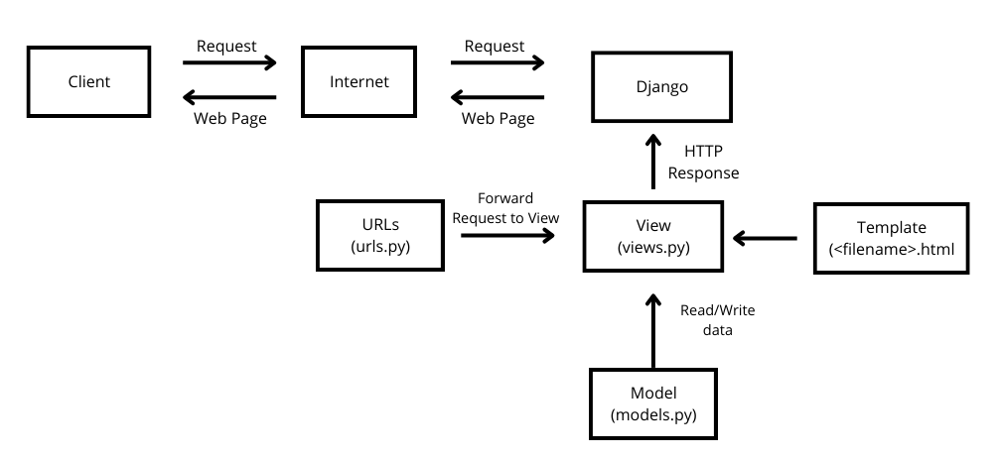
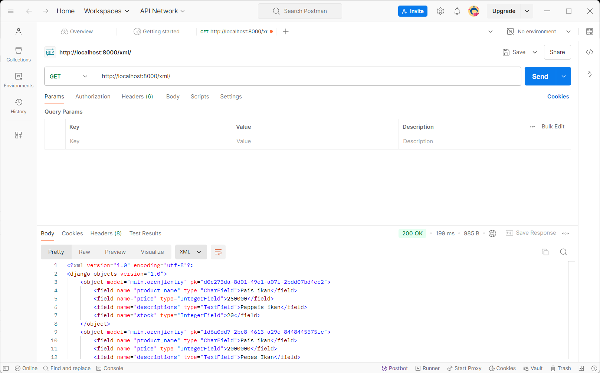
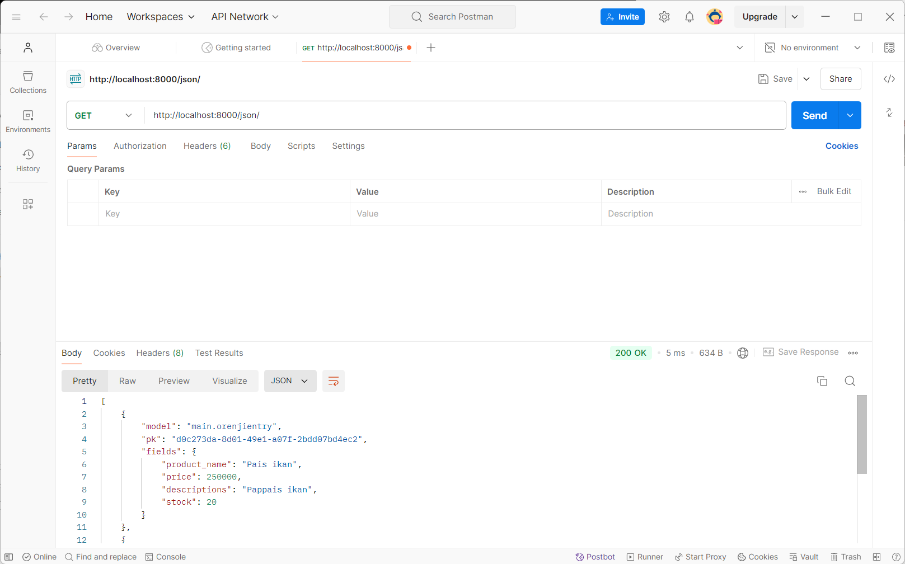
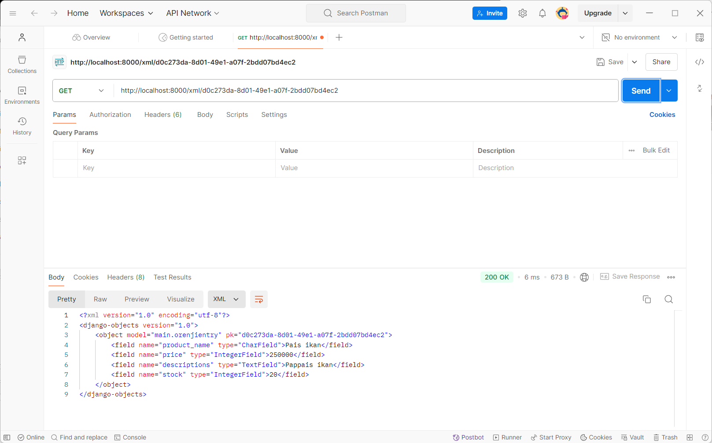
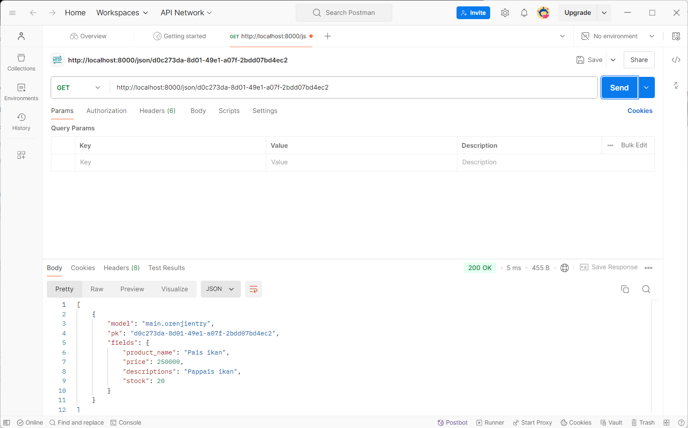

Nama : Faiz Assabil Firdaus  
NPM : 2306224354  
Kelas : PBP F

# List of Contents
- [Tugas 2](#tugas-2)
- [Tugas 3](#tugas-3)

# Tugas 2

## Jelaskan bagaimana cara kamu mengimplementasikan checklist di atas secara step-by-step (bukan hanya sekadar mengikuti tutorial)?

### 1. Membuat sebuah proyek Django baru

```bash
django-admin startproject orenji .
```

### 2. Membuat aplikasi dengan nama `main` pada proyek tersebut

```bash
python manage.py startapp main
```

### 3. Membuat model pada aplikasi `main` dengan nama `Product` dan memiliki atribut wajib sebagai berikut

- Kode untuk model `Product` yang dibuat pada `main/models.py`:

```python
from django.db import models

class OrenjiEntry(models.Model):
    name = models.CharField(max_length=255)
    price = models.IntegerField()
    descriptions = models.TextField()
    stock = models.IntegerField()

    @property
    def is_can_buy(self):
        return self.stock > 0
```

### 4. Membuat fungsi pada `views.py` untuk dikembalikan ke dalam sebuah template HTML

- Kode untuk fungsi `show_main` pada `main/views.py`:

```python
from django.shortcuts import render

def show_main(request):
    identitas = {
        'nama': 'Faiz Assabil Firdaus',
        'npm': '2306224354',
        'kelas': 'F'
    }
    context = {
        'product_name': 'materai 2500',
        'price': 2000,
        'description': 'materai 2500 tapi diskon mahalnya di ongkir',
        'stock': 2
    }

    context.update(identitas)

    return render(request, "main.html", context)
```

### 5. Membuat template HTML untuk menampilkan informasi

- Kode untuk `main/templates/main.html`:

```html
<h5>Nama Produk: </h5>
<p>{{ product_name }}</p>

<h5>Harganya: </h5>
<p>{{ price }}</p>

<h5>Deskripsi Produk: </h5>
<p>{{ description }}</p>

<h5>Stock: </h5>
<p>{{ stock }}</p>

<h5>Nama Pemilik Produk: </h5>
<p>{{ nama }}</p>

<h5>NPM Pemilik Produk: </h5>
<p>{{ npm }}</p>

<h5>Kelas Pemilik Produk: </h5>
<p>{{ kelas }}</p>
```

### 6. Melakukan routing pada proyek agar dapat menjalankan aplikasi `main`

- Kode untuk `orenji/urls.py`:

```python
from django.contrib import admin
from django.urls import path, include

urlpatterns = [
    path('admin/', admin.site.urls),
    path('', include('main.urls')),
]
```

### 7. Membuat routing pada `urls.py` aplikasi `main` untuk memetakan fungsi yang telah dibuat pada `views.py`

- Kode untuk `main/urls.py`:

```python
from django.urls import path
from main.views import show_main

app_name = 'main'

urlpatterns = [
    path('', show_main, name='show_main'),
]
```

## Buatlah bagan yang berisi request client ke web aplikasi berbasis Django beserta responnya dan jelaskan pada bagan tersebut kaitan antara urls.py, views.py, models.py, dan berkas html



## Jelaskan fungsi git dalam pengembangan perangkat lunak!

Git dalam pengembangan perangkat lunak berfungsi seperti Google Docs dalam mengerjakan PR secara bersama-sama. Git menjadi tempat untuk berkolaborasi dalam pengembangan perangkat lunak, mirip seperti Google Drive atau Google Docs yang berfungsi sebagai wadah penyimpanan dan kolaborasi dokumen. Dengan Git, proyek pengembangan perangkat lunak dapat dikelola dengan lebih baik dan terintegrasi, sehingga memastikan proyek berjalan dengan lancar.

## Menurut Anda, dari semua framework yang ada, mengapa framework Django dijadikan permulaan pembelajaran pengembangan perangkat lunak?

Hal ini dikarenakan Django merupakan framework berbasis Python, yang bahasanya dekat dengan kita dan terkenal mudah dipelajari, terutama bagi pemula. Python sendiri memiliki sintaks yang sederhana dan mudah dipahami, sehingga mempermudah transisi dalam memahami konsep-konsep pengembangan web.

Namun, tidak hanya sekadar mudah dimengerti, Django juga merupakan framework yang sangat kuat dan scalable. Django digunakan pada aplikasi terkenal seperti Instagram, Spotify, dan YouTube, yang menunjukkan bahwa framework ini mampu menangani kebutuhan pengembangan perangkat lunak dalam skala besar dan kompleks. Django juga dilengkapi dengan banyak fitur bawaan seperti sistem otentikasi, manajemen basis data, dan keamanan, yang mempermudah proses pengembangan tanpa harus membangun semuanya dari awal.

## Mengapa model pada Django disebut sebagai ORM?

Selaras dengan arti Object Relational Mapping, yang berfungsi sebagai jembatan antara object-oriented programming dan basis data relasional, model pada Django berfungsi untuk menjembatani antara database dan objek-objek Python. Model Django memungkinkan pengembang untuk bekerja dengan database menggunakan kode Python yang berorientasi objek, sehingga mempermudah manipulasi dan interaksi dengan data tanpa harus menulis query SQL secara langsung.

# Tugas 3

## **Jelaskan mengapa kita memerlukan data delivery dalam pengimplementasian sebuah platform?**

Sama halnya seperti interaksi antar orang, kita akan menyimpan dan memberikan informasi yang penting. Maka dari itu, dalam sebuah platform, diperlukan adanya interaksi informasi tersebut, yang mencakup proses menyimpan dan mengirim data. Data delivery memungkinkan informasi tersebut dapat berpindah dari satu tempat ke tempat lain dengan aman dan efisien.

---

## Menurutmu, mana yang lebih baik antara XML dan JSON? Mengapa JSON lebih populer dibandingkan XML?

Menurut saya, JSON lebih baik karena strukturnya yang sederhana dan mirip dengan dictionary pada Python, sehingga lebih mudah dibaca dan ditulis oleh manusia serta lebih efisien dalam proses pengiriman data. JSON menggunakan format berbasis teks yang ringan, dengan key-value pairs yang membuatnya lebih ringkas dibandingkan XML, yang memiliki banyak tag pembuka dan penutup. Selain itu, JSON lebih mudah diparse oleh browser dan aplikasi modern. Oleh karena itu, JSON lebih populer dibandingkan XML karena lebih praktis dan mudah digunakan dalam pengembangan web dan aplikasi modern.

**Struktur JSON:**

```json
{
    "product_name": "Orenji Juice",
    "price": 15000,
    "stock": 20
}
```

**Struktur XML:**

```xml
<product>
    <product_name>Orenji Juice</product_name>
    <price>15000</price>
    <stock>20</stock>
</product>
```

---

## Jelaskan fungsi dari method is_valid() pada form Django dan mengapa kita membutuhkan method tersebut?

Method `is_valid()` pada form Django berfungsi untuk memeriksa apakah data yang diinputkan melalui form sesuai dengan aturan dan validasi yang telah ditetapkan pada model atau form itu sendiri. Method ini akan mengembalikan nilai `True` jika semua data yang diisi valid, dan `False` jika ada data yang tidak sesuai. Kita membutuhkan method ini untuk memastikan data yang dikirimkan oleh pengguna adalah valid sebelum disimpan ke database atau diproses lebih lanjut oleh aplikasi.

## Mengapa kita membutuhkan csrf_token saat membuat form di Django? Apa yang dapat terjadi jika kita tidak menambahkan csrf_token pada form Django? Bagaimana hal tersebut dapat dimanfaatkan oleh penyerang?

`csrf_token` diperlukan saat membuat form di Django untuk melindungi aplikasi dari serangan CSRF (Cross-Site Request Forgery), di mana penyerang bisa memanfaatkan sesi pengguna yang sah untuk melakukan permintaan berbahaya tanpa sepengetahuan mereka. Jika `csrf_token` tidak ditambahkan, aplikasi menjadi rentan terhadap serangan ini, dan penyerang bisa melakukan tindakan berbahaya seperti perubahan data atau transaksi secara ilegal dengan menggunakan identitas pengguna. Tanpa token ini, aplikasi tidak dapat membedakan permintaan yang sah dari pengguna atau yang dimanipulasi oleh pihak ketiga.

## **Jelaskan bagaimana cara kamu mengimplementasikan checklist di atas secara step-by-step (bukan hanya sekadar mengikuti tutorial)**

1. **Membuat `forms.py` di folder `main` untuk membuat form produk (`OrenjiEntryForm`)**

    ```python
    from django import forms
    from .models import OrenjiEntry

    class OrenjiEntryForm(forms.ModelForm):
        class Meta:
            model = OrenjiEntry
            fields = ['product_name', 'price', 'descriptions', 'stock']
    ```

2. **Membuat fungsi `create_orenji_entry` di `views.py` untuk menambahkan produk**

    ```python
    from django.shortcuts import render, redirect
    from .forms import OrenjiEntryForm

    def create_orenji_entry(request):
        form = OrenjiEntryForm(request.POST or None)
        if form.is_valid() and request.method == "POST":
            form.save()
            return redirect('main:show_main')

        context = {'form': form}
        return render(request, 'create_orenji_entry.html', context)
    ```

3. **Membuat `create_orenji_entry.html` di folder `templates/main` untuk menampilkan form produk**

    ```html
    <h1>Add New Product Entry</h1>

    <form method="POST">
      
      <table>
        {{ form.as_table }}
        <tr>
          <td></

td>
          <td>
            <input type="submit" value="Add Product" />
          </td>
        </tr>
      </table>
    </form>
    ```

4. **Menambahkan `csrf_token` pada form di `create_orenji_entry.html` untuk mencegah serangan CSRF**

5. **Menambahkan fungsi `show_xml`, `show_json`, `show_xml_by_id`, dan `show_json_by_id` di `views.py` untuk menampilkan data dalam format XML dan JSON**

    ```python
    from django.http import HttpResponse
    from django.core import serializers

    def show_xml(request):
        data = OrenjiEntry.objects.all()
        return HttpResponse(serializers.serialize("xml", data), content_type="application/xml")

    def show_json(request):
        data = OrenjiEntry.objects.all()
        return HttpResponse(serializers.serialize("json", data), content_type="application/json")

    def show_xml_by_id(request, id):
        data = OrenjiEntry.objects.filter(pk=id)
        return HttpResponse(serializers.serialize("xml", data), content_type="application/xml")

    def show_json_by_id(request, id):
        data = OrenjiEntry.objects.filter(pk=id)
        return HttpResponse(serializers.serialize("json", data), content_type="application/json")
    ```

6. **Membuat `urls.py` di folder `main` untuk melakukan routing**

    ```python
    from django.urls import path
    from main.views import show_main, create_orenji_entry, show_xml, show_json, show_xml_by_id, show_json_by_id

    app_name = 'main'

    urlpatterns = [
        path('', show_main, name='show_main'),
        path('add-product/', create_orenji_entry, name='add_product'),
        path('xml/', show_xml, name='show_xml'),
        path('json/', show_json, name='show_json'),
        path('xml/<str:id>/', show_xml_by_id, name='show_xml_by_id'),
        path('json/<str:id>/', show_json_by_id, name='show_json_by_id'),
    ]
    ```

---

## Screenshot hasil menggunakan Postman:

- Show XML: 
- Show JSON: 
- Show XML by ID: 
- Show JSON by ID: 
